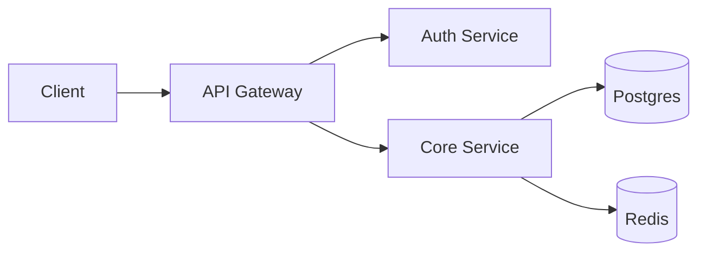
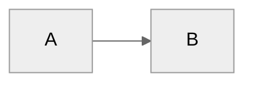

# Visuals — Banner, Logo, GIF, Screenshots

The single highest-leverage README improvement is adding a demo GIF or screenshot above the fold. It converts skimmers into readers.

---

## 1. Banner

Hero image that spans the top. Sets tone before words do.

**Dimensions (sane defaults):**
- 1280 × 640 (2:1) — standard
- 1500 × 500 (3:1) — slim
- 1920 × 800 — wide screens

**Tips:**
- Include the project name in the banner itself (redundant with H1, but intentional)
- Keep file size under 500 KB — use WebP if possible
- Dark and light variants via `<picture>` (see below)

```md
<p align="center">
  
</p>
```

**Dark/light-aware banner:**

```md
<picture>
  <source media="(prefers-color-scheme: dark)" srcset="docs/banner-dark.png">
  <source media="(prefers-color-scheme: light)" srcset="docs/banner-light.png">
  
</picture>
```

**Tools to make a banner:**
- Figma (free)
- Canva (templates)
- [readme-artwork](https://github.com/abranhe/readme-artwork) — programmatic
- Midjourney / Nano Banana Pro → then crop

---

## 2. Logo

Small square, centered near the title. Signals identity without taking space.

**Dimensions:**
- 80 × 80 — compact
- 120 × 120 — default
- 200 × 200 — loud

```md
<div align="center">
  <a href="https://github.com/OWNER/REPO">
    
  </a>
</div>
```

**Prefer SVG** for logos — scales, smaller than PNG at large sizes. Bitmap only if the logo has raster detail.

---

## 3. Demo GIF

The most impactful visual for CLIs, terminal apps, and UI-animation-heavy projects. Shows the core loop in < 15 seconds.

**Rules:**
- Keep under **5 MB** — GitHub balks on large GIFs
- Length: **5–15 seconds** ideal, never over 30
- Dimensions: **720–960 px wide** (not full HD — render is scaled by GitHub anyway)
- Show only the core interaction. Cut everything else.
- Loop cleanly: first frame ≈ last frame

```md
<p align="center">
  
</p>
```

### 3.1 Tools to make GIFs

**Terminal recordings (best):**
- **[VHS](https://github.com/charmbracelet/vhs)** — scripted, reproducible, commit the `.tape` file. Top pick for CLI demos.
- **[terminalizer](https://github.com/faressoft/terminalizer)** — similar, renders to GIF/Web.
- **[asciinema](https://asciinema.org)** + [agg](https://github.com/asciinema/agg) — records → convert to GIF.
- **[ttystudio](https://github.com/chjj/ttystudio)** — terminal-to-GIF, no headaches.

**Screen recording (UI, desktop apps):**
- **[ScreenToGif](https://www.screentogif.com/)** — Windows, free, edit frame-by-frame.
- **[Gifski](https://gif.ski/)** — macOS, best color/size tradeoff.
- **[Peek](https://github.com/phw/peek)** — Linux, simple.
- **[Giphy Capture](https://giphy.com/apps/giphycapture)** — macOS, quick uploads.
- **[LICEcap](https://www.cockos.com/licecap/)** — cross-platform, old but reliable.

**Optimization (shrink the GIF):**
- `gifsicle -O3 --lossy=80 in.gif -o out.gif` — up to 80% smaller
- Convert to **WebM / MP4** for bigger size cuts. GitHub auto-plays MP4 when uploaded as `.mp4`.

### 3.2 VHS recipe (recommended for CLI projects)

`docs/demo.tape`:

```
Output docs/demo.gif
Set Width 900
Set Height 500
Set Theme "Catppuccin Mocha"
Set FontSize 16
Set TypingSpeed 40ms

Type "mytool init my-project"
Enter
Sleep 1s

Type "cd my-project && mytool build"
Enter
Sleep 3s

Type "mytool deploy --env=prod"
Enter
Sleep 2s
```

Render:

```sh
vhs docs/demo.tape
```

Commit the `.tape` — anyone can regenerate the GIF.

---

## 4. Screenshots

For web and desktop apps. Less flashy than GIFs but easier to produce and consume.

**Rules:**
- Use real data (not "Foo Bar Lorem Ipsum")
- Crop to meaningful content
- Annotate sparingly — arrows/boxes only when necessary
- Explicit `width` attribute — never ship a 4K screenshot inline

### 4.1 Single screenshot

```md
<p align="center">
  
</p>
```

### 4.2 Screenshot grid

```md
<table>
  <tr>
    <td></td>
    <td></td>
  </tr>
  <tr>
    <td></td>
    <td></td>
  </tr>
</table>
```

### 4.3 Before / After (sliders are not supported, use side-by-side)

```md
| Before | After |
|---|---|
|  |  |
```

---

## 5. Architecture diagrams

Use Mermaid — renders natively on GitHub, commit-friendly, diff-able.

````md
## Architecture


````

### Mermaid chart types useful in READMEs

- `flowchart` — component diagrams
- `sequenceDiagram` — request/response flows
- `erDiagram` — database schema
- `stateDiagram-v2` — state machines
- `gantt` — roadmap timelines
- `C4Context` / `C4Container` — architecture layers

### Non-Mermaid options

- **draw.io / diagrams.net** → export SVG, commit it
- **Excalidraw** → export PNG + `.excalidraw` source
- **PlantUML** + `plantuml-server` — supported via third-party badge hosts

---

## 6. Video

GitHub renders `.mp4` inline with native controls. Cleaner than GIF for > 15 s content.

```md
https://github.com/OWNER/REPO/assets/USERID/UUID.mp4
```

(Drag-and-drop the MP4 into a GitHub issue/PR, grab the resulting URL.)

**YouTube thumbnail trick:**

```md
[](https://www.youtube.com/watch?v=VIDEO_ID)
```

Or use the auto-thumbnail:

```md
[](https://www.youtube.com/watch?v=VIDEO_ID)
```

---

## 7. Dark / Light mode tricks

GitHub supports `prefers-color-scheme` via `<picture>`. Use it for logos, diagrams, badges that don't look good on both themes.

```md
<picture>
  <source media="(prefers-color-scheme: dark)" srcset="docs/logo-dark.svg">
  
</picture>
```

Also works for Mermaid with theme initialization:

````md

````

---

## 8. Where to store assets

- **`docs/`** — standard, used by most projects
- **`.github/assets/`** — some repos use this to keep docs clean
- **`assets/`** or **`images/`** — fine but less conventional
- **NEVER** use `raw.githubusercontent.com` URLs pointing to `main` in your own repo — they break on rename. Use relative paths.

---

## 9. Quick visual quality checklist

- [ ] Every image has meaningful `alt` text
- [ ] Every image has an explicit `width` (bytes-saving for readers)
- [ ] GIFs under 5 MB
- [ ] Banner & screenshots are dark/light-mode aware (or neutral)
- [ ] No broken image links (`docs/foo.png` but `docs/` not committed)
- [ ] All rasters have at least 2× pixel density for retina
- [ ] Mermaid diagrams compile (preview in a GitHub markdown preview)
