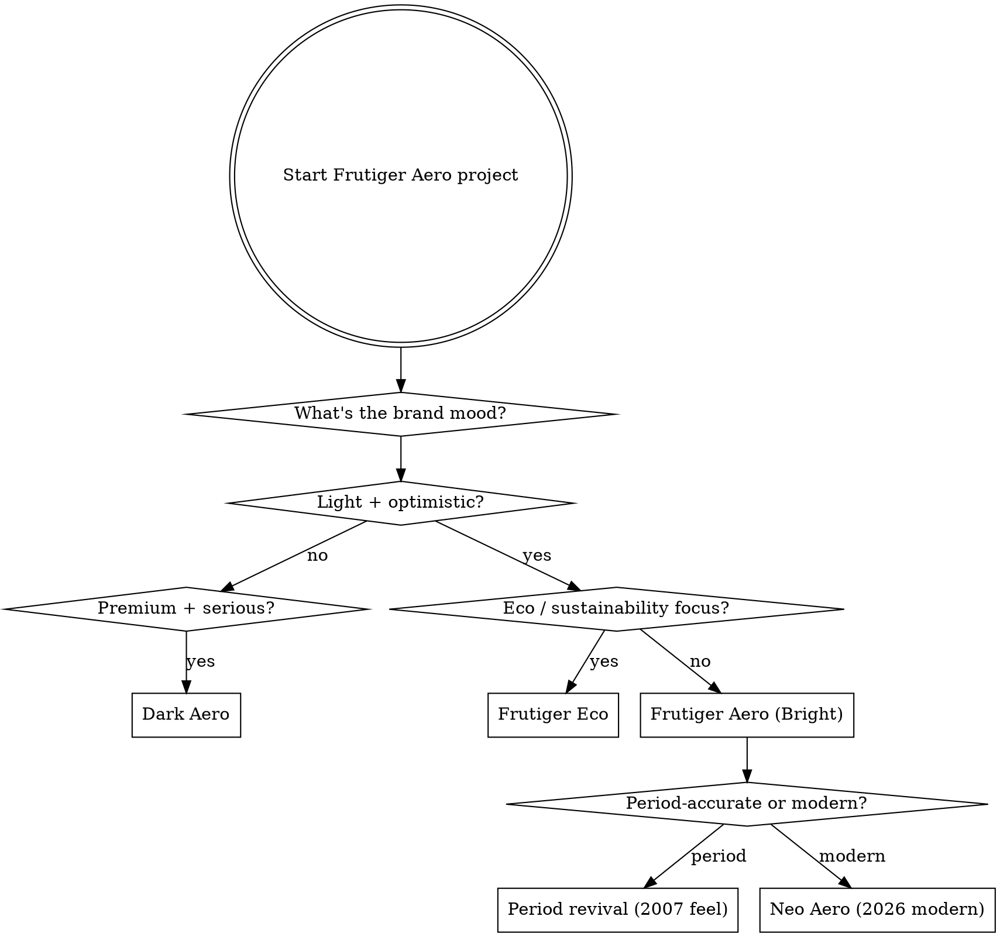

# Frutiger Aero Site Builder

## Overview

Build production-grade Frutiger Aero websites from scratch using a tested CSS token system + component library + workflow. Aesthetic-specific application of [[Refactoring UI Methodology]] discipline.

**Core principle:** Frutiger Aero is **disciplined glossy revival**, not "throw bubbles + green at everything." The aesthetic survives the 2026 era only when executed with system rigor — proper tokens, [[Glossy Gradient Pattern]] precision, accessibility maintained.

## When to Use

Use this skill when:
- Client wants 2000s nostalgic vibes (eco-tech, AI wellness, sustainability, indie creative)
- Building portfolio with Frutiger Aero direction
- Implementing Frutiger Aero revival (2022+ resurgence pattern)
- Need to choose between Bright Aero / Dark Aero / Frutiger Eco / Frutiger Aurora variants
- Avoiding generic "glassmorphism on gradient" defaults

Do NOT use for:
- Generic modern SaaS (use plain frontend-design)
- Heavily flat-design brands
- Conservative B2B / finance / legal
- When client said "minimalist Swiss" or similar opposite direction

## Quick Reference

### Variant decision (read FIRST)

| Project context | Recommended variant | Why |
|----------------|---------------------|-----|
| Eco-tech / sustainability | **Frutiger Eco** (Bright Aero + green-heavy) | Period-aligned, natural fit |
| AI wellness / mindfulness | **Frutiger Aero** + soft aurora | Optimistic + calm |
| Premium tech / dev tools | **Dark Aero** | Mature, business-oriented |
| Portfolio / creative | **Neo Aero** (2026 revival) | Modern execution + ironic nostalgia |
| Music / nightlife | **Frutiger Aurora** | Cosmic + lens flare |
| Beach / wellness / aquatic | **Helvetica Aqua Aero** | Tropical Y2K crossover |

### Workflow (4 main phases)

1. **Plan** → confirm variant + scope (read `references/01-aesthetic-variants.md`)
2. **Foundation** → import design tokens (`references/02-design-tokens.css`)
3. **Build components** → reference component recipes (`references/03-glossy-buttons.md`, `04-glass-panels.md`, `05-aurora-backgrounds.md`, `06-skeumorphic-orbs.md`)
4. **Assemble + polish** → page composition (`references/07-build-workflow.md`)

## Core Pattern — The Aero CSS Token System

Every Frutiger Aero site starts here. Copy `assets/css/aero-tokens.css` into project, then customize colors per client.

```css
/* Read references/02-design-tokens.css for full system. Snippet: */
:root {
  /* Aero green primary palette */
  --aero-green-500: hsl(130, 75%, 45%);  /* #3cda56-adjacent */
  --aero-green-glow: #57fa6f;
  
  /* Signature glossy gradient (HARD mid-break = period accurate) */
  --aero-gloss-button: linear-gradient(to bottom,
    #fff 0%, #82f577 3%,
    #32912a 40%,
    #185815 55%,    /* HARD BREAK */
    #0b3112 55%,
    #1a5c1e 100%);
  
  /* Glass effects */
  --aero-glass-bg: rgba(20, 20, 20, 0.5);
  --aero-blur: blur(10px) saturate(150%);
  --aero-inset-gloss: inset 0 1px 0 rgba(255,255,255,0.4);
  
  /* Depth */
  --aero-shadow-card: 0 10px 30px rgba(0,0,0,0.25);
  --aero-shadow-deep: 0 14px 28px rgba(0,0,0,0.25), 0 10px 10px rgba(0,0,0,0.22);
}
```

## When Decision Non-Obvious



## Build Order (zero to site)

**START HERE** for any FA project:

1. **Read** `references/01-aesthetic-variants.md` → confirm variant (Bright/Dark/Eco/Aurora/Aqua/Cream/Peach)
2. **Read** `references/10-period-layout-patterns.md` → confirm structure (Pattern A/B/C/D/E)
3. **Read** `references/09-anti-ai-pitfalls.md` → avoid AI-default traps
4. **Copy** `assets/css/aero-tokens.css` into project, customize palette + radius signatures
5. **Build** window-chrome wrapper (Pattern A default — container + sidebar + main)
6. **Build** title bar OR banner header (asymmetric border-radius signature)
7. **Build** sidebar nav with categorized sections
8. **Compose** main content as editorial (multiple sections, real text, embedded links)
9. **Add** signature detail (custom cursor, hero orb, marquee, etc.) — ONE memorable element
10. **Verify** with `references/08-quality-checklist.md` + anti-AI 5-question test

**DO NOT** start with: centered hero + 4-card grid. That's AI default, not Frutiger Aero.

## Example complete HTML

Open `examples/01-hero-landing.html` in browser — fully working Frutiger Aero landing with all primary components assembled.

Use it as starting template, not literal copy.

## Common Mistakes (CRITICAL — from oldweb survey analysis)

| Mistake | Fix |
|---------|-----|
| **Centered hero + 4-card uniform grid** (AI DEFAULT) | Use Pattern A: container + sidebar + main editorial — see `references/10-period-layout-patterns.md` |
| **Full-bleed layout** (modern default) | Period sites use `max-width: 700-1300px` container — NEVER full-bleed |
| **Uniform border-radius everywhere** | Use asymmetric signature: `70px 80px 0 0` (window) or `70px 70px 10px 10px` (banner) for ONE element |
| **Text-only headline as hero** | Use banner image OR Vista metallic title bar — see `examples/01` and `examples/02` |
| **Horizontal centered nav** | Period sites use **left sidebar with categorized sections** (Vista style) |
| **Pure CSS gradient as bg** | Use **photo background** + radial overlay — period sites prefer photo |
| Smooth gradient on buttons | Use HARD mid-break at ~55%/55% — see `references/03-glossy-buttons.md` |
| Generic green (`#10b981` Tailwind) | Use `#3cda56` family OR cream `#6b9a4f` — see `aero-tokens.css` themes |
| Inter / Roboto typography | Segoe UI stack (period) or characterful display (Reckless, DM Serif Display) |
| Heavy backdrop-filter everywhere | Pick `blur(1px)` subtle (archive style) or `blur(10px)` strong (modern) — commit to one |
| AI-generated FA imagery as hero | Period source from Asadal, photograph yourself, or use community archive — anti-AI |
| Generic copy ("Get Started", "Learn More") | Specific personal voice — "Welcome to [name], a [description]..." pattern |
| Minimal content (headline + subhead + CTA) | Period FA was **content-rich** — multi-paragraph intros with embedded links |

## Anti-AI 5-Question Test

Before shipping, verify:

1. **Container full-bleed?** YES → fix (use max-width 700-1300px)
2. **4-card uniform feature grid?** YES → fix (use gallery, bento, or editorial)
3. **Horizontal centered nav?** YES → fix (use sidebar with categories)
4. **Heading text-only (no banner/title-bar)?** YES → fix (add image or metallic gradient)
5. **All border-radius uniform?** YES → fix (asymmetric for at least one element)

If 3+ YES = AI-default. Rebuild structure before shipping.

See `references/09-anti-ai-pitfalls.md` for full diagnostic + remediation.

## Anti-patterns to avoid

❌ Treating Frutiger Aero as just "glassmorphism with green"
❌ Smooth modern gradients (lose period feel)
❌ AI-generated aurora backgrounds (community anti-AI)
❌ Inter/Roboto typography (defaults — see [[Production Grade Frontend Rules]])
❌ Skipping accessibility (gloss can hurt contrast — see `references/08-quality-checklist.md`)
❌ Mixing Dark Aero + Bright Aero in same site
❌ Heavy backdrop-filter on mobile without perf check

## Reference index

- `references/01-aesthetic-variants.md` — Which Aero variant for this project?
- `references/02-design-tokens.css` — Complete CSS variable system documentation
- `references/03-glossy-buttons.md` — Period-accurate glossy CTA recipes + states
- `references/04-glass-panels.md` — Backdrop-filter cards + windows
- `references/05-aurora-backgrounds.md` — Hero background patterns (CSS + WebGL)
- `references/06-skeumorphic-orbs.md` — Logo treatment + 3D bubble/orb signatures
- `references/07-build-workflow.md` — Zero-to-complete-site checklist
- `references/08-quality-checklist.md` — Pre-launch verification (perf + a11y + brand)
- **`references/09-anti-ai-pitfalls.md`** — What makes FA look AI-generic vs period-accurate (CRITICAL)
- **`references/10-period-layout-patterns.md`** — Pattern A/B/C/D/E from oldweb survey (CRITICAL)

## Reference assets

- `assets/css/aero-tokens.css` — Ready-to-import CSS variable system (Bright + Dark + Eco + Cream + Peach themes)
- `examples/01-hero-landing.html` — **Pattern A** (Dark Aero, window chrome + sidebar + editorial)
- `examples/02-neocities-warm-cream.html` — **Pattern A variant** (cream palette, indie warm cozy)

## Related vault knowledge

This skill operationalizes the following vault concepts:
- [[Frutiger Aero]] — aesthetic foundation
- [[Glossy Gradient Pattern]] — signature CSS technique
- [[Composite Nostalgia]] — imagery sourcing strategy
- [[Refactoring UI Methodology]] — execution discipline applied to Aero
- [[Design Originality]] — avoid AI-generic patterns
- [[Production Grade Frontend Rules]] — quality baseline
- [[Accessibility WCAG]] — non-negotiable
- [[Old Web Layout Patterns]] — Pattern A-E from oldweb survey (CRITICAL)
- [[Old Web Sites Survey (41 sites)]] — 41 period + indie revival sites analyzed

## Source material verified

This skill is verified against 41 real period + indie sites in `siti-oldweb/`:
- 6 direct Frutiger Aero references (frutigeraeroarchive.org, frutiger-aero.it/.org/.neocities.org, forum/map subdomains)
- 4 Vista/Windows-CSS framework users (7.css, 98.css)
- 24 Neocities indie personal sites (derrek.org, cinni.net, skeltrr, tackyvillain, etc.)
- 5 modern designer portfolios (sharyap.com, ghostcatte.art, etc.)
- 2 special/experimental

Patterns extracted from real working sites, not AI hallucinations.
